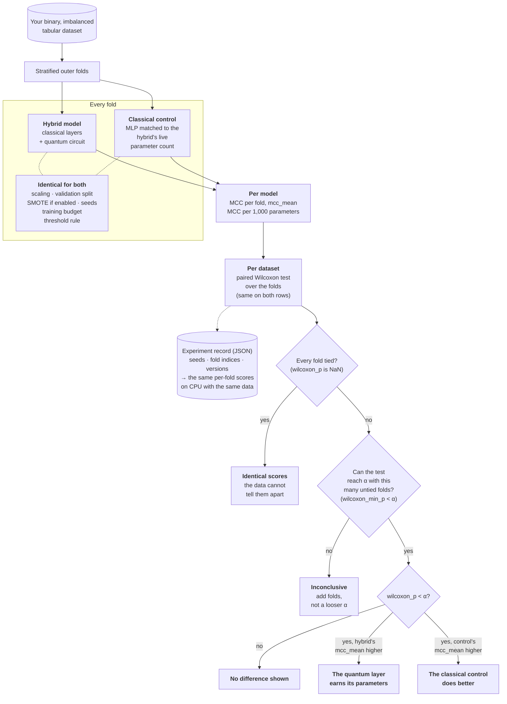
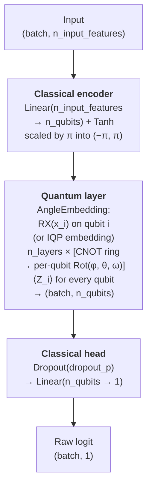
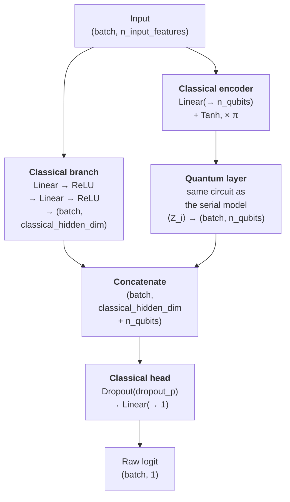

<h1></h1>

[](https://github.com/hqnn-forge/hqnn-forge/actions/workflows/tests.yml)
[](https://github.com/hqnn-forge/hqnn-forge/blob/main/LICENSE)
[](https://hqnn-forge.github.io/hqnn-forge/)

> **Test whether a small quantum layer earns its parameters on imbalanced binary tabular data.**

`hqnn-forge` is a research library for hybrid quantum-classical classifiers: **PennyLane**
circuits inside **PyTorch** models, trained end to end. It is built around one question: on
an imbalanced binary classification problem, does a small quantum layer add enough per
parameter to justify it? The library brings the parts needed to answer it on your own data:
hybrid models, a scikit-learn estimator, imbalance-robust losses, stratified CV with SMOTE,
threshold search, MCC per thousand parameters, a paired Wilcoxon test, ablation of the quantum
layer, and circuit diagnostics.

**Scope.** Binary classification on imbalanced tabular data, or data made tabular by a
pretrained embedding (see
[Non-tabular data](https://github.com/hqnn-forge/hqnn-forge#non-tabular-data-precomputed-embeddings)).
The estimator, losses, thresholds and metrics are built for binary targets;
`MulticlassHybridClassifier` covers multiclass targets at the model level only. End-to-end
image, text or time-series pipelines are out of scope.

**Documentation.** The API reference, rendered from the docstrings, is at
**<https://hqnn-forge.github.io/hqnn-forge/>**, together with the
[methodology](https://hqnn-forge.github.io/hqnn-forge/methodology/) the comparisons follow.

---

## How a benchmark works

`run_benchmark` trains the hybrid model and a classical control side by side on each dataset.
The control is an MLP matched to the hybrid's live parameter count (see *Classical control*
below), and in every fold both models get the same data and the same treatment. A difference in
their scores is therefore down to the quantum layer, not to extra capacity.



`run_benchmark` stops at the scores and the test columns (`wilcoxon_p`, `wilcoxon_min_p`,
`rank_biserial`); the outcomes at the bottom are how to read those columns at the α you choose.
Its own `alpha` argument only sets the significance level of the noise sweep's summary. Folds
where both models score the same MCC drop out of the test, so they do not count towards reaching
α. Two further steps are separate calls, not part of `run_benchmark`: ablation of a trained
model's quantum layer (`disable_quantum_layer`, `permute_quantum_layer`), and the comparison
across datasets.

---

## Key Features

| Feature | Detail |
|---|---|
| **Small-angle init** | Gaussian initialisation: global σ = π/√(n·L), or a per-layer schedule σ_ℓ = π/√(n·(L+ℓ)) that starts at the global σ and narrows by up to √2 towards the last layer (this library's own heuristics, in the spirit of Zhang et al. 2022). Measured with `hqnn_forge.diagnostics.gradient_variance` on a 2-layer circuit with a ⟨Z_0⟩ cost: no gain over uniform init for inputs spread over (−π, π), which is what both classifiers feed the circuit, and a gain growing from 1.1x to 1.75x between 4 and 8 qubits only near zero input. Over (−π, π) the variance falls ~3x per two qubits under either init — see the module docstring |
| **Automatic backend choice** | `device_name="auto"` (the default) trains on `default.qubit` with backprop up to 12 qubits and on `lightning.qubit` with exact adjoint gradients above; see *Which to train with* |
| **Custom angle encoding** | Angle-embedding feature map (8 qubits by default) with a CNOT-ring VQC ansatz; strongly-entangling, brickwork and hardware-efficient (CZ + RY) entanglers are options |
| **Imbalance-robust losses** | Focal Loss & inverse-frequency weighted BCE |
| **Pure-NumPy pre-processing** | PCA + standardisation without scikit-learn runtime dependency |
| **Three hybrid topologies** | Serial `HybridBinaryClassifier`, parallel `ParallelHybridClassifier` (classical MLP branch ‖ quantum branch) and multiclass `MulticlassHybridClassifier` (softmax or one-vs-rest heads on a shared quantum layer), with angle or IQP encoding |
| **Data-driven decision threshold** | `find_optimal_threshold` picks the threshold that maximises MCC, F1 or balanced accuracy on validation probabilities, instead of the default 0.5 that is rarely the right operating point on imbalanced data |
| **Quantum ablation** | `disable_quantum_layer` replaces a trained model's quantum-layer output with a constant for the duration of a `with` block, so re-scoring a `ParallelHybridClassifier` shows how much the circuit adds to its classical branch (in the serial `HybridBinaryClassifier` the circuit is the only path, so the ablated model is a constant predictor) |
| **Checkpoints** | `save_checkpoint` / `load_checkpoint` store a classifier's class, constructor arguments and weights, and rebuild the model from that file; a file written by a different `hqnn_forge` version is refused unless `allow_version_mismatch=True` |

---

## Installation

To use the package, install it from a clone of the repository with pip:

```bash
pip install -e ".[lightning]"
```

The extras add optional parts; combine them as needed, e.g. `".[lightning,sklearn]"`:

| Extra | Installs | Needed for |
|---|---|---|
| `lightning` | `pennylane-lightning` | the `lightning.qubit` backend and adjoint differentiation, which the default `"auto"` picks above 12 qubits |
| `sklearn` | `scikit-learn` | the scikit-learn estimator in `hqnn_forge.sklearn` |
| `examples` | `scikit-learn`, `matplotlib` | the scripts in `examples/` and the plots in `hqnn_forge.evaluation` |
| `dev` | test and lint tools | development; see [Development Setup](https://github.com/hqnn-forge/hqnn-forge#development-setup) |

pip installs the newest versions that `pyproject.toml` allows. To work on the project in the
environment CI tests against, use the uv setup under [Development Setup](https://github.com/hqnn-forge/hqnn-forge#development-setup).

### Device backends

Every encoding layer and classifier takes a `device_name`. For the four simulators below, if
the requested backend is not installed or finds no usable hardware, the library falls back one
step at a time, with a `RuntimeWarning` at each step, along
`requested → lightning.qubit → default.qubit`. Any other PennyLane device name (a plugin such
as `qiskit.aer`, or hardware) is constructed exactly as given; a misspelt name raises instead
of falling back.

`shots=N` (default `None`, exact) samples every readout from `N` measurements, as hardware
does, and needs `diff_method="parameter-shift"`; hardware devices need both.
`hqnn_forge.noise.apply_shots` evaluates an exactly trained model under sampling, and
`shot_sweep` repeats that across shot counts. The samples come from the device's own
generator, which `torch.manual_seed` does not reach; pass `seed=` to the model or layer for
shot-based runs that repeat.

| `device_name` | What it is | Prerequisites |
|---|---|---|
| `default.qubit` | PennyLane's reference state-vector simulator (Python/NumPy) | None; always available |
| `lightning.qubit` | C++ state-vector simulator, CPU; adjoint differentiation | `pip install -e ".[lightning]"` (`pennylane-lightning`) |
| `lightning.gpu` | State-vector simulator on NVIDIA GPUs via cuQuantum (cuStateVec) | `pip install pennylane-lightning-gpu`; Linux, an NVIDIA GPU with compute capability ≥ 7.0, a CUDA 12 driver. The wheel pulls in `custatevec-cu12` |
| `lightning.kokkos` | State-vector simulator on Kokkos; OpenMP-parallel CPU on the PyPI wheel, CUDA or HIP GPUs when built from source | `pip install pennylane-lightning-kokkos` for the CPU build; see the [PennyLane-Lightning docs](https://docs.pennylane.ai/projects/lightning/) for a GPU build |

The GPU backends pay off at larger qubit counts or batch sizes. Both accelerated devices support
the same `diff_method="adjoint"` as `lightning.qubit`.

**Which to train with.** `lightning.qubit` with adjoint runs a batch one sample at a time;
`default.qubit` with `diff_method="backprop"` vectorises it. Measured for one training step at
batch 64 (`examples/benchmark_batching.py --crossover`):

| qubits | `lightning.qubit` / adjoint | `default.qubit` / backprop | backprop vs lightning |
|---|---|---|---|
| 8 | 0.36 s, +11 MB | 0.03 s, +10 MB | 12× faster, same memory |
| 10 | 0.44 s, +14 MB | 0.08 s, +55 MB | 5.5× faster, 4× the memory |
| 12 | 0.64 s, +18 MB | 0.25 s, +283 MB | 2.6× faster, 16× the memory |
| 14 | 1.47 s, +21 MB | 1.66 s, +1125 MB | about as fast, 54× the memory |
| 16 | 8.85 s, +31 MB | 10.42 s, +3129 MB | about as fast, 100× the memory |

Single runs, which vary by some tens of percent; at 14 and 16 qubits either path can come out
ahead. For batched training backprop is 5-12× faster at 8 to 10 qubits for little memory, and
still about 2.6× faster at 12 qubits for 16× the memory. From about 14 qubits the speed
advantage is gone, while backprop's memory keeps growing fourfold per two qubits and adjoint's
stays flat, so lightning is the better choice there. For single samples lightning is faster.

That is what the default, `device_name="auto", diff_method="auto"`, does:

| | picks |
|---|---|
| up to 12 qubits | `default.qubit` / backprop |
| above 12 qubits | `lightning.qubit` / adjoint (falling back to `default.qubit` / adjoint without the `lightning` extra) |
| `shots` set | the size rule's device / parameter-shift |
| amplitude encoding behind the classical encoder | `default.qubit` / backprop at any size, the only method whose input gradient is correct |
| an explicit `device_name` | backprop on `default.qubit` and `default.mixed`, adjoint on `lightning.qubit`, `lightning.gpu` and `lightning.kokkos`, parameter-shift on anything else |
| an explicit `diff_method` | `default.qubit` for backprop, `lightning.qubit` for adjoint, else the size rule |

`hqnn_forge.encoding.resolve_backend` shows the choice for given arguments. The model config,
and so a checkpoint, records `"auto"`, so a reloaded model resolves it again by these rules,
from the qubit count and options alone; only the fallback when `lightning` is not installed
depends on the machine. Pass both names explicitly to pin a backend.

Backprop's memory also grows with the batch. `predict_proba` and the trainer's validation
currently run their whole input as one batch (chunking is #469), so for large evaluation sets
near 12 qubits pass `device_name="lightning.qubit"` explicitly.

### Running on hardware

[`examples/hardware_workflow.py`](https://github.com/hqnn-forge/hqnn-forge/blob/main/examples/hardware_workflow.py)
trains a small classifier the way a quantum device requires, on `default.qubit` standing in for one: `shots`, parameter-shift
gradients checked against backprop, SPSA, the circuit executions each step costs (counted
with `qml.Tracker`), and test MCC under shot and depolarizing noise (`shot_sweep`,
`noise_sweep`). One step on a batch of 32 costs 1568 circuits with parameter-shift and 64 with
SPSA, which trains the circuit weights while Adam trains the classical head at no extra circuit
cost. Trained with 1000 shots and evaluated exactly, it scored 0.87 test MCC against 0.83 for
exact training with backprop and Adam (one seed, 115 test samples).

For a real device, change `DEVICE` to the plugin's device name (for example
`"braket.aws.qubit"`) and set up its credentials as the plugin documents.
The library creates the device from its name, so device options go in PennyLane's
[configuration file](https://docs.pennylane.ai/en/stable/introduction/configuration.html),
which `qml.device` reads for every device:

```toml
# config.toml
[braket.aws.qubit]
device_arn = "arn:aws:braket:::device/qpu/..."
```

An option that must be a Python object rather than a string cannot be passed this way, so a
device that needs one, such as `"qiskit.remote"` (its `backend`), does not work here. The
library passes `seed` to a plugin device as given, so the example seeds only the simulators in
`KNOWN_DEVICES`.

---

## Quick Start: your own data

`HybridClassifierEstimator` trains a hybrid model on any binary `X, y` through the usual
scikit-learn `fit` / `predict` / `predict_proba`, so it also works in `Pipeline`,
`cross_val_score` and `GridSearchCV`. It needs the `sklearn` extra:

```python
from sklearn.datasets import make_classification
from sklearn.model_selection import train_test_split
from sklearn.pipeline import make_pipeline
from sklearn.preprocessing import StandardScaler

from hqnn_forge.evaluation import matthews_corrcoef, parameter_efficiency
from hqnn_forge.sklearn import HybridClassifierEstimator

# Any imbalanced binary X, y; here 2,000 rows, 20 features, 5% positives
X, y = make_classification(n_samples=2000, n_features=20, weights=[0.95], random_state=0)
X_train, X_test, y_train, y_test = train_test_split(X, y, stratify=y, random_state=0)

clf = make_pipeline(
    StandardScaler(),
    HybridClassifierEstimator(
        n_qubits=4,
        n_layers=2,
        max_epochs=20,
        batch_size=8,
        validation_fraction=0.2,
        random_state=0,
    ),
)
clf.fit(X_train, y_train)  # about a minute on a laptop CPU

mcc = matthews_corrcoef(y_test, clf.predict(X_test))
print(f"test MCC {mcc:.3f}")
print(f"MCC per 1,000 parameters {parameter_efficiency(clf[-1].model_, mcc):.2f}")
```

The model's classical encoder (`Linear` + `tanh`, scaled by π) maps any number of features
onto the qubits, so the input width is free. With `validation_fraction` set, a stratified
share of the training data drives early stopping and picks the decision threshold that
`predict` uses. On a dataset this small, a batch size well below the default 64 gives the
optimiser enough steps in 20 epochs; with the default, early stopping often ends the run
before the model has learnt anything. MCC, not accuracy, is the metric here: with 5%
positives, predicting the majority class alone is 95% accurate.

### Non-tabular data: precomputed embeddings

Images, text or time series can be used through embeddings from any pretrained model. Reduce
the embeddings to `n_qubits` dimensions and pass `use_classical_encoder=False`, so the quantum
layer reads them directly:

```python
from hqnn_forge.preprocessing import PCANormalizer
from hqnn_forge.sklearn import HybridClassifierEstimator

# emb_train, emb_test: (n_samples, d) arrays from a pretrained model; y_train: 0/1 labels
pca = PCANormalizer(n_components=8)  # centre, keep 8 components, standardise them, tanh(·)·π
Z_train = pca.fit_transform(emb_train).numpy()
Z_test = pca.transform(emb_test).numpy()

clf = HybridClassifierEstimator(n_qubits=8, use_classical_encoder=False)
clf.fit(Z_train, y_train)
proba = clf.predict_proba(Z_test)[:, 1]
```

Without the encoder, each input value is used unscaled as a rotation angle, so it has to lie
in (−π, π) already. Values outside that range wrap around modulo 2π, and distant inputs can
land on the same angle. `PCANormalizer` keeps them inside with `tanh(·)·π`. The input width
must equal `n_qubits`, and the model refuses anything else.

### Worked example: credit-card fraud

`hqnn_forge.data.load_credit_card_fraud` loads the Kaggle Credit Card Fraud Detection dataset
(284,807 transactions, 492 frauds, 0.17% positive), the benchmark the library was first
developed on. The CSV is not redistributable. Download it once with the Kaggle CLI
(`kaggle datasets download -d mlg-ulb/creditcardfraud -p data/raw --unzip`), or pass
`download=True`:

```python
from hqnn_forge.data import load_credit_card_fraud

data = load_credit_card_fraud()  # data/raw/creditcard.csv, or $HQNN_FORGE_DATA
X, y = data.X, data.y  # (284807, 30) float64, (284807,) int64
```

### The models directly, in PyTorch

```python
import torch
from hqnn_forge.models import HybridBinaryClassifier
from hqnn_forge.utils import FocalLoss

model = HybridBinaryClassifier(n_input_features=8, n_qubits=8, n_layers=2)
loss_fn = FocalLoss(alpha=0.25, gamma=2.0)

x = torch.randn(16, 8)  # batch of 16 samples, 8 PCA features
y = torch.randint(0, 2, (16,)).float()

logits = model(x)
loss = loss_fn(logits.squeeze(), y)
loss.backward()
```

See `examples/quick_start.py` for a full training loop on a synthetic imbalanced dataset, and
the API reference for every argument:
[scikit-learn estimator](https://hqnn-forge.github.io/hqnn-forge/api/sklearn/),
[preprocessing](https://hqnn-forge.github.io/hqnn-forge/api/preprocessing/),
[data](https://hqnn-forge.github.io/hqnn-forge/api/data/),
[evaluation](https://hqnn-forge.github.io/hqnn-forge/api/evaluation/),
[models](https://hqnn-forge.github.io/hqnn-forge/api/models/),
[losses and utilities](https://hqnn-forge.github.io/hqnn-forge/api/utils/),
[training](https://hqnn-forge.github.io/hqnn-forge/api/training/).

---

## Architecture

Three hybrid topologies share the same building blocks. The two binary ones return a raw
logit of shape `(batch, 1)`: apply `torch.sigmoid` for a probability, or pass it straight to
`FocalLoss`. The multiclass one returns `(batch, n_classes)` logits.

### `HybridBinaryClassifier` (serial)



The quantum layer shows the defaults; see the options below for the axis, the entangler and the
⟨Z_0⟩-only readout. `dropout_p` is 0 by default.

### `ParallelHybridClassifier` (parallel)



The parallel model asks whether added classical capacity can substitute for, or extend, what
the quantum layer contributes: compare `count_parameters()` across the two at equal `n_qubits`
and `n_layers`.

### `MulticlassHybridClassifier` (multiclass)

The serial trunk with `n_classes` heads, `Linear(n_qubits → n_classes)`, all reading the same
quantum layer, so the quantum parameter count does not depend on `n_classes`. Its forward pass
returns raw logits `(batch, n_classes)`.

- `strategy="softmax"` (default): `predict_proba` is the softmax over classes; train with
  `nn.CrossEntropyLoss`.
- `strategy="one_vs_rest"`: each head is one class against the rest, and `predict_proba` is the
  per-class sigmoid normalised to sum to one; train with `nn.BCEWithLogitsLoss` on
  `model.one_hot(y)`.

`predict` returns the argmax of the logits as `torch.long` labels. It does not follow the
binary `predict(x, threshold)` contract of `BinaryClassifierBase`, and it does not yet support
`embedding_rotation`, `entangler`, `readout` or `encoder_activation` (#226).

Options shared by both models:

- `encoding_type="angle"` (default), `"iqp"` (Havlíček-style feature map with pairwise
  `x_i x_j` phases), `"reuploading"` (the angle embedding repeated before every variational
  layer, with optional `trainable_input_scaling`) or `"amplitude"` (the classical encoder maps
  to `2**n_qubits` amplitudes, which needs `diff_method="backprop"`; without the encoder, 1 to
  `2**n_qubits` raw features are zero-padded).
- `init_strategy="restricted"` (one σ for the whole circuit), `"block_local"` (the same σ in
  the first layer, narrowing by up to √2 towards the last) or `"normal"` (plain
  `N(0, init_std²)`, `init_std=0.1` by default); see `hqnn_forge.initializers`.
- `embedding_rotation="X"` (default), `"Y"` or `"Z"`: the Pauli axis of the angle embedding
  (angle and re-uploading encodings only). `"Z"` raises under angle encoding: a single `RZ`
  embedding on `|0⟩` is a global phase, so the quantum layer would ignore its inputs. Under
  re-uploading it needs `n_layers ≥ 2`.
- `entangler="ring"` (default: CNOT ring then per-qubit `Rot`), `"strongly_entangling"`
  (`qml.StronglyEntanglingLayers`: `Rot` first, then a CNOT ring whose range grows with the
  layer index), `"brickwork"` (nearest-neighbour CNOT pairs without wrap-around, so each
  ⟨Z_i⟩ readout depends on a few neighbouring qubits at shallow depth rather than on all of
  them) or `"hardware_efficient"` (a nearest-neighbour `CZ` ladder then `RY` on every qubit,
  Kandala et al. 2017: one angle per qubit per layer, so the weights have shape
  `(n_layers, n_qubits)` instead of `(n_layers, n_qubits, 3)`).
- `readout="all"` (default: ⟨Z_i⟩ on every qubit) or `"first"` (⟨Z_0⟩ only, so the head reads
  a single number).
- `encoder_activation="tanh"` (default: `tanh(·)·π`, in (-π, π)) or `"sigmoid"`
  (`π·sigmoid(·)`, in (0, π)).
- `published_shnn()` on either class builds the configuration published in the thesis and in
  `hqnn-fraud-detection-benchmark`: 8 qubits, 2 layers, RY embedding, strongly-entangling
  ansatz, ⟨Z_0⟩ readout, sigmoid encoder, `N(0, 0.1²)` init — 122 trainable parameters for the
  serial model, of which **102 are live**: with the ⟨Z_0⟩ readout, 20 quantum weights can never
  move the output. They are kept, so the published model and its checkpoints stay as published,
  and both counts are reported; parameter-efficiency figures use the total unless stated
  (4.72 MCC/kParam published, 5.65 over the live 102). Keyword arguments override it.
- `use_classical_encoder=False` to feed features already scaled into (-π, π), for example from
  `PCANormalizer(scale_to_pi=True)`, straight into the circuit. `n_input_features` must then
  equal `n_qubits`.
- `dropout_p` on the features entering the head, and `predict_proba` / `predict`, which always
  run in eval mode.

### Classical control

`hqnn_forge.utils.classical_baseline(model)` builds the classical model a hybrid result should
be compared with: an untrained `ClassicalBaseline` MLP, to be trained from scratch on the same
data. Its trainable parameter count is matched to the hybrid's **live** count,
`model.count_parameters()` minus the circuit weights that can never move the output
(`circuit_summary(model).n_inert_params`), with every other rotation angle counted as one
parameter, so the two models are compared at the same usable parameter budget. The serial
model's control is one hidden layer in place of encoder, circuit and head; the parallel model's
is its classical branch plus a head, widened to the matching width. The published SHNN's 122
parameters, 102 of them live, get a 101-parameter control; matched on the total it would get
121. The structural inert count is a lower bound (16 of the 20 here), so the control is never
smaller than an exact live match would make it. Efficiency figures (MCC/kParam) still use the
total. A seeded hybrid (`init_seed`) gets a control seeded with the same seed.
Switching a trained model's circuit off with `disable_quantum_layer` measures something
else, how much that model depends on the circuit.

The API reference documents each architecture's constructor and the pieces behind it:
[models](https://hqnn-forge.github.io/hqnn-forge/api/models/),
[encoding layers](https://hqnn-forge.github.io/hqnn-forge/api/encoding/),
[circuit primitives](https://hqnn-forge.github.io/hqnn-forge/api/circuits/),
[initialisers](https://hqnn-forge.github.io/hqnn-forge/api/initializers/),
[diagnostics](https://hqnn-forge.github.io/hqnn-forge/api/diagnostics/),
[utilities](https://hqnn-forge.github.io/hqnn-forge/api/utils/).

---

## Folder Structure

```
hqnn_forge/
├── encoding/        Quantum feature maps (angle, IQP, amplitude, data re-uploading)
├── circuits/        Reusable VQC ansatz primitives
├── initializers/    Small-angle (restricted-variance) weight initialisation
├── preprocessing/   PCA + normalisation, stratified folds, SMOTE (no sklearn runtime dep)
├── models/          Full hybrid architectures
├── training/        Train/validate loop with early stopping
├── evaluation/      Decision threshold search, confusion metrics, PR-AUC, score per
│                    parameter, paired Wilcoxon tests, plots (needs matplotlib)
├── diagnostics/     Circuit cost (depth, gates, inert parameters), gradient variance,
│                    Fisher information and effective dimension
├── data/            Dataset loader (Kaggle credit-card fraud)
├── utils/           Imbalance-robust losses, checkpoint save/load, quantum-layer ablation,
│                    eval-mode context manager
├── kernels.py       Quantum kernel matrices from the encoding layers (QSVM)
├── noise.py         Noise channels (depolarizing, damping, flips), post hoc or during training
└── sklearn.py       scikit-learn estimator wrapper (cross_val_score, GridSearchCV, Pipeline);
                     needs the `sklearn` extra
```

---

## Reproducing the published SHNN

`HybridBinaryClassifier.published_shnn()` matches the published model structurally, and
`tests/test_published_shnn_parity.py` pins that. Whether the library also reproduces the
published *numbers* (MCC 0.5758 ± 0.0371, MCC/kParam 4.720) is checked by an opt-in run of the
benchmark's recipe: 5-fold CV with SMOTE on the training folds, 100 epochs. It needs the Kaggle
dataset and takes days of simulation:

```bash
HQNN_FORGE_REPRODUCE=1 HQNN_FORGE_DATA=data/raw \
    pytest tests/test_published_shnn_reproduction.py -m reproducibility -s
```

The module docstring lists the recipe and every deliberate deviation from the benchmark code.
**Status:** not yet measured. The numbers go here once a full run has finished.

---

## Development Setup

The project is managed with [uv](https://docs.astral.sh/uv/getting-started/installation/):

```bash
uv sync --all-extras
uvx pre-commit install
```

`uv sync --all-extras` creates `.venv` with the project installed in editable mode and every
extra (`lightning`, `sklearn`, `examples`, `dev`) at the versions pinned in `uv.lock`. It is
the environment the `test-locked` CI job builds with `uv sync --locked --all-extras`; `--locked`
additionally fails instead of updating a `uv.lock` that no longer matches `pyproject.toml`.
Run tools inside it with `uv run`, e.g. `uv run pytest`, or activate `.venv`.

Without uv, `pip install -e ".[lightning,sklearn,examples,dev]"` installs the same extras at
the newest versions `pyproject.toml` allows, as the pip-based `test` CI job does. The pre-commit
hooks below still need uv.

The `dev` extra brings `ruff`, `mypy`, `vermin` and `pytest`. `uvx pre-commit install` registers the hooks
in `.pre-commit-config.yaml`, which run `ruff check --fix` and `ruff format` on every commit with
the settings from `pyproject.toml`, and refuse a commit that adds a file over 1000 KB (a dataset,
a checkpoint). CI applies the same size limit to every tracked file. The hooks call ruff through `uv run`, so they need
[uv](https://docs.astral.sh/uv/getting-started/installation/) on the `PATH` and use the ruff
version pinned in `uv.lock`, the same one CI uses. To run them over the whole tree at any time:

```bash
uvx pre-commit run --all-files
```

The hooks cover the two ruff steps of the CI lint job, including the Python code blocks in
Markdown files. The lint job also type-checks the package, the tests and the examples with
mypy, and checks stdlib usage against Python 3.11 with vermin; the hooks do neither. Run
them before pushing:

```bash
uv run --frozen --all-extras mypy hqnn_forge tests examples
uv run --frozen --all-extras vermin --no-tips -t=3.11- --violations --eval-annotations \
    --exclude long hqnn_forge tests examples .github/scripts
```

[`CONTRIBUTING.md`](https://github.com/hqnn-forge/hqnn-forge/blob/main/CONTRIBUTING.md#linting) lists every command the lint job runs.

The full test suite takes a few minutes. For the edit–test loop, leave out the tests marked
`slow` (end-to-end training, the gradient-variance physics checks, parameter-shift batching,
repeated fits and bootstraps), which account for most of that time; CI always runs everything
(see [`CONTRIBUTING.md`](https://github.com/hqnn-forge/hqnn-forge/blob/main/CONTRIBUTING.md#testing)):

```bash
pytest -m "not slow"   # about a minute
pytest                 # the full suite, as CI runs it
```

---

## Methodology

The [methodology page](https://hqnn-forge.github.io/hqnn-forge/methodology/)
([source](https://github.com/hqnn-forge/hqnn-forge/blob/main/docs/methodology.md))
states the rules the comparisons follow: how the classical control is matched, how folds,
oversampling and thresholds are handled, which statistical test applies when, the equal tuning
budget, what the noise sweep models, and what an experiment record captures.

---

## Documentation

The API reference, generated from the docstrings, is at
**<https://hqnn-forge.github.io/hqnn-forge/>**. To build it locally:

```bash
uv run --frozen --group docs mkdocs serve   # or: mkdocs build --strict, as CI does
```

---

## Contributing

See [`CONTRIBUTING.md`](https://github.com/hqnn-forge/hqnn-forge/blob/main/CONTRIBUTING.md) for the
issue/branch/PR workflow, commit conventions, and versioning policy this project follows. To add
a dataset loader, an encoding layer or a variational block, see
[`docs/extending.md`](https://github.com/hqnn-forge/hqnn-forge/blob/main/docs/extending.md) for the
conventions each must keep and the tests each must pass.

---

## Citing

If you use hqnn-forge in research, please cite it.
[`CITATION.cff`](https://github.com/hqnn-forge/hqnn-forge/blob/main/CITATION.cff) holds the citation
metadata, and GitHub's **Cite this repository** button in the sidebar turns it into BibTeX or
APA.

---

## References

- Cerezo et al. (2021) — *Cost function dependent barren plateaus in shallow parametrized quantum circuits*
- McClean et al. (2018) — *Barren plateaus in quantum neural network training landscapes*
- Zhang et al. (2022) — *Escaping from the barren plateau via Gaussian initializations in deep variational quantum circuits*
- Grant et al. (2019) — *An initialization strategy for addressing barren plateaus in parametrized quantum circuits*
- Abbas et al. (2021) — *The power of quantum neural networks*
- Berezniuk et al. (2020) — *A scale-dependent notion of effective dimension*
- Schuld et al. (2020) — *Circuit-centric quantum classifiers*
- Sim et al. (2019) — *Expressibility and entangling capability of parameterized quantum circuits for hybrid quantum-classical algorithms*
- Meyer & Wallach (2002) — *Global entanglement in multiparticle systems*
- Brennen (2003) — *An observable measure of entanglement for pure states of multi-qubit systems*
- Scott (2004) — *Multipartite entanglement, quantum-error-correcting codes, and entangling power of quantum evolutions*
- Jones & Gacon (2020) — *Efficient calculation of gradients in classical simulations of variational quantum algorithms*
- Kandala et al. (2017) — *Hardware-efficient variational quantum eigensolver for small molecules and quantum magnets*
- Havlíček et al. (2019) — *Supervised learning with quantum-enhanced feature spaces*
- Schuld & Killoran (2019) — *Quantum machine learning in feature Hilbert spaces*
- Hubregtsen et al. (2022) — *Training quantum embedding kernels on near-term quantum computers*
- Higham (1988) — *Computing a nearest symmetric positive semidefinite matrix*
- Pérez-Salinas et al. (2020) — *Data re-uploading for a universal quantum classifier*
- Schuld, Sweke & Meyer (2021) — *Effect of data encoding on the expressive power of variational quantum-machine-learning models*
- Möttönen et al. (2005) — *Transformation of quantum states using uniformly controlled rotations*
- Schuld & Petruccione (2018) — *Supervised Learning with Quantum Computers*
- Lin et al. (2017) — *Focal Loss for Dense Object Detection*
- King & Zeng (2001) — *Logistic Regression in Rare Events Data*
- Hubregtsen et al. (2022) — *Training Quantum Embedding Kernels on Near-Term Quantum Computers*
- Cortes, Mohri & Rostamizadeh (2012) — *Algorithms for Learning Kernels Based on Centered Alignment*
- Chawla et al. (2002) — *SMOTE: Synthetic Minority Over-sampling Technique*
- Wilcoxon (1945) — *Individual comparisons by ranking methods*
- Kerby (2014) — *The simple difference formula: an approach to teaching nonparametric correlation*
- Efron (1987) — *Better bootstrap confidence intervals*
- Efron & Tibshirani (1993) — *An Introduction to the Bootstrap*
- Demšar (2006) — *Statistical Comparisons of Classifiers over Multiple Data Sets*
- Friedman (1937) — *The Use of Ranks to Avoid the Assumption of Normality Implicit in the Analysis of Variance*
- Iman & Davenport (1980) — *Approximations of the Critical Region of the Friedman Statistic*
- Holm (1979) — *A Simple Sequentially Rejective Multiple Test Procedure*
- Nemenyi (1963) — *Distribution-Free Multiple Comparisons*
- Bergholm et al. (2022) — *PennyLane: Automatic differentiation of hybrid quantum-classical computations*
- Platt (1999) — *Probabilistic outputs for support vector machines and comparisons to regularized likelihood methods*
- Naeini, Cooper & Hauskrecht (2015) — *Obtaining well calibrated probabilities using Bayesian binning*
- Guo, Pleiss, Sun & Weinberger (2017) — *On calibration of modern neural networks*
- Mukhoti et al. (2020) — *Calibrating deep neural networks using focal loss*
- Spall (1992) — *Multivariate stochastic approximation using a simultaneous perturbation gradient approximation*
- Spall (1998) — *Implementation of the simultaneous perturbation algorithm for stochastic optimization*
